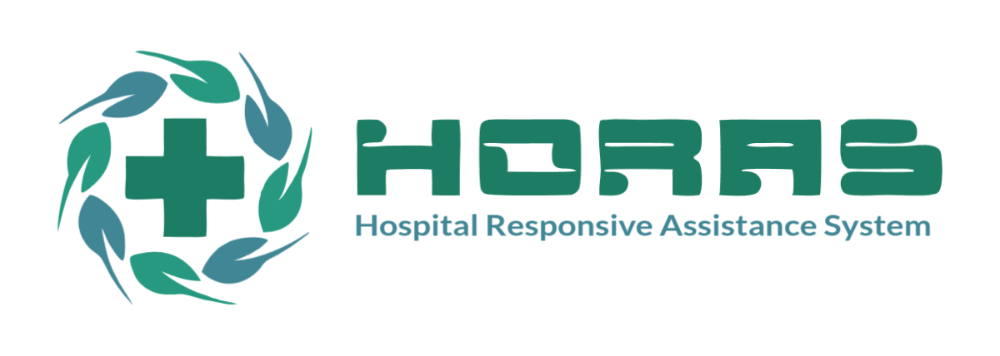

<div id="top"></div>
<!-- PROJECT LOGO -->
<br />
<div align="center">
  
  <h3 align="center">HORAS Project</h3>
  <p align="center">
    Hospital Responsive Assistant System
    <br />
    <a href="#">View Demo</a>
    ·
    <a href="https://github.com/theycantrevealus/horas/issues">Report Bug</a>
    ·
    <a href="https://github.com/theycantrevealus/horas/issues">Request Feature</a>
  </p>
</div>


<!-- TABLE OF CONTENTS -->
<details>
  <summary>Table of Contents</summary>
  <ol>
    <li>
      <a href="#about-the-project">About The Project</a>
      <ul>
        <li><a href="#built-with">Built With</a></li>
      </ul>
    </li>
    <li>
      <a href="#getting-started">Getting Started</a>
      <ul>
        <li><a href="#prerequisites">Prerequisites</a></li>
        <li><a href="#installation">Installation</a></li>
      </ul>
    </li>
    <li><a href="#usage">Usage</a></li>
    <li><a href="#roadmap">Roadmap</a></li>
    <li><a href="#contributing">Contributing</a></li>
    <li><a href="#license">License</a></li>
    <li><a href="#contact">Contact</a></li>
    <li><a href="#acknowledgments">Acknowledgments</a></li>
  </ol>
</details>


<!-- ABOUT THE PROJECT -->
## About The Project

HORAS is an open source Hospital Information System. It was created for helping hospital as an assistant to run business easily, help to make business or medical decisions by datas, faster department integity, universal business core.

Here's why:
* Humanity. Helping hospital faster to save lives
* Minimize unnecessary expense leakage in order to maximize health services
* A kind of expensive paid application that makes it difficult for small scale hospitals to run faster

<p align="right">(<a href="#top">back to top</a>)</p>


### Built With

Built using these awesome framework

* [Nest.js](https://nestjs.com/)
* [Vue.js](https://vuejs.org/)

<p align="right">(<a href="#top">back to top</a>)</p>


<!-- GETTING STARTED -->
## Getting Started
Bismillah aja...
<p align="right">(<a href="#top">back to top</a>)</p>


### API Service
* Create <b>.env</b> file from <b>.env.example</b> format and adjust with your local setting
* Run api service
  ```sh
  npm run start
  ```
  Watch Mode
  ```sh
  npm run start:dev
  ```
<p align="right">(<a href="#top">back to top</a>)</p>


### Installation

_Below is an example of how you can instruct your audience on installing and setting up your app. This template doesn't rely on any external dependencies or services._

1. Get a free API Key at [https://example.com](https://example.com)
2. Clone the repo
   ```sh
   git clone https://github.com/theycantrevealus/horas.git
   ```
3. Enter your config in `.env`
4. Install NPM packages (for each folder api and app)
   ```sh
   npm install
   ```

<p align="right">(<a href="#top">back to top</a>)</p>


<!-- USAGE EXAMPLES -->
## Usage

Use this space to show useful examples of how a project can be used. Additional screenshots, code examples and demos work well in this space. You may also link to more resources.

_For more examples, please refer to the [Documentation](https://example.com)_

<p align="right">(<a href="#top">back to top</a>)</p>


<!-- ROADMAP -->
## Roadmap

- [x] Add Changelog
- [x] Add back to top links
- [ ] Add Additional Templates w/ Examples
- [ ] Add "components" document to easily copy & paste sections of the readme
- [ ] Multi-language Support
    - [ ] English
    - [ ] Indonesia

See the [open issues](https://github.com/theycantrevealus/horas/issues) for a full list of proposed features (and known issues).

<p align="right">(<a href="#top">back to top</a>)</p>


<!-- CONTRIBUTING -->
## Contributing

Contributions are what make the open source community such an amazing place to learn, inspire, and create. Any contributions you make are **greatly appreciated (God Bless Your Kind Heart)**.

If you have a suggestion that would make this better, please fork the repo and create a pull request. You can also simply open an issue with the tag "enhancement".
Don't forget to give the project a star! Thanks again!

1. Fork the Project
2. Create your Feature Branch (`git checkout -b feature/AmazingFeature`)
3. Commit your Changes (`git commit -m 'Add some AmazingFeature'`)
4. Push to the Branch (`git push origin feature/AmazingFeature`)
5. Open a Pull Request

Make sure to write properly test and run it on locally to keep commits clean on remote repository
<p align="right">(<a href="#top">back to top</a>)</p>


<!-- STRUCTURE -->
## Project Structure

<b>HORAS</b> contains 2 main project directory (api and app). You need to run npm start/serve on each folder to run it.

API default run on port 3000. You can access Open API at `<hostname>:3000/api`

<p align="right">(<a href="#top">back to top</a>)</p>


<!-- LICENSE -->
## License

Distributed under the APACHE 2.0 License. See `LICENSE.txt` for more information.

<p align="right">(<a href="#top">back to top</a>)</p>


<!-- CONTACT -->
## Contact

Hendry Tanaka - [@takashitanaka_](https://twitter.com/takashitanaka_) - theycantrevealus@gmail.com

Project Link: [https://github.com/theycantrevealus/horas](https://github.com/theycantrevealus/horas)

<p align="right">(<a href="#top">back to top</a>)</p>


<!-- ACKNOWLEDGMENTS -->
## Acknowledgments

Use this space to list resources you find helpful and would like to give credit to. I've included a few of my favorites to kick things off!

* [Choose an Open Source License](https://choosealicense.com)
* [GitHub Emoji Cheat Sheet](https://www.webpagefx.com/tools/emoji-cheat-sheet)
* [Malven's Flexbox Cheatsheet](https://flexbox.malven.co/)
* [Malven's Grid Cheatsheet](https://grid.malven.co/)
* [Img Shields](https://shields.io)
* [GitHub Pages](https://pages.github.com)
* [Font Awesome](https://fontawesome.com)
* [React Icons](https://react-icons.github.io/react-icons/search)

<p align="right">(<a href="#top">back to top</a>)</p>


<!-- MARKDOWN LINKS & IMAGES -->
